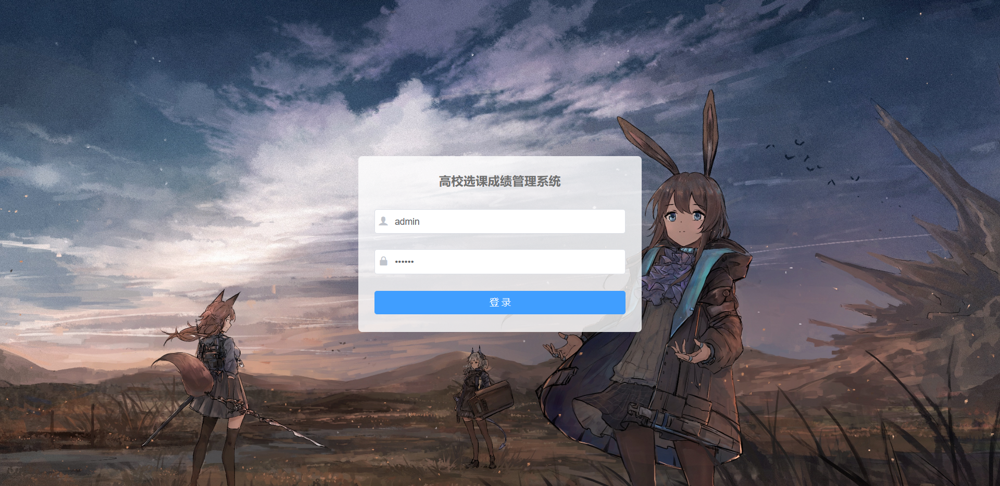

<div align="center">


# CampusOverFlow

<br>

<div>
    
    
</div>
<div>
    
</div>
<div>
    
    
    
</div>
<br>

[简体中文](README_ZH.md)  | [English](README_EN.md) 

高校选课成绩管理系统<br>

</div>

<br>

## 功能特性
前端用vue+ElementUI实现, 后端用c++实现的服务器

<br>

## 文件结构
<!-- 用tree命令生成文件结构 -->
- assets => 资源文件
- doc => 存放开发相关文档

<br>

## 软件架构
B/S架构

<br>


## 依赖检查

- mysql

- jwt-cpp

- cmake

- libjsoncpp

  

  <br>

## 构建
```shell
make
```

<br>

## 运行
```shell
./server
```

<br>

## 使用指南


<br>

## 如何贡献
如果你碰巧看见这个项目, 想要参与开发

可以查看这个文档 [如何参与开源项目](doc/github参与开源项目流程.md)

<br>

## 关于作者
keeser

<br>

## 许可证
MPL 2.0